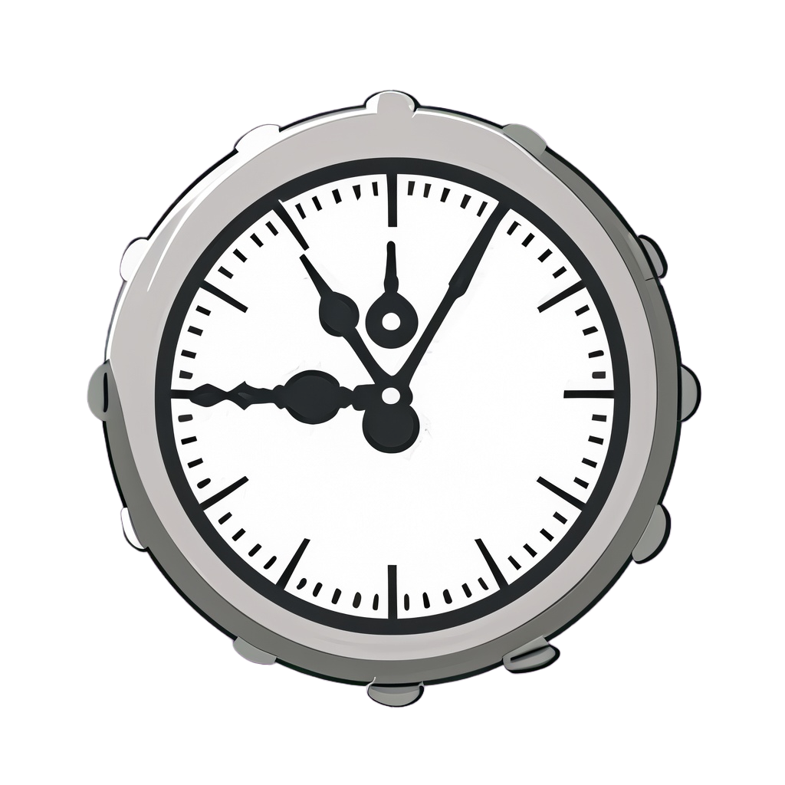

# SecondSight: Minimalist Time Tracker

SecondSight is a time management application that empowers you to categorize and track your daily activities with ease. Seamlessly created using Kotlin, Jetpack Compose, Room, and Gradle, this app allows you to have better control over your time and boost your productivity. Whether you're working, studying, exercising, or just spending some quality time, SecondSight is your personal assistant for all things time tracking.

  

## Why SecondSight?

I started this project to learn and explore the latest Android development technologies. Along the way, I learned about both basic and advanced Android development concepts and tools.

In addition, I had some prior experience with Java, but this project gave me the opportunity to learn Kotlin and understand its features and differences compared to Java. I also gained knowledge about managing libraries and dependencies using Gradle, which was an area I wasn't very proficient in before. I was able to apply this knowledge in a real-world application.

Finally, I was able to learn about the latest Android UI toolkit, Jetpack Compose, and its features. I was able to create a fully functional app using Compose, which was a great learning experience.

## Features

* Create, edit, and delete tasks
* Track task progress with entries and notifications
* Dark and Light themes for better accessibility
* Consistency tracking for regular tasks
* Delete task entries as needed

## Requirements

* For development: Android Studio
* For usage: Android 7+ devices

## Installation and Usage

1. Open the project in Android Studio.
2. Run the app on any Android 7+ emulator or device.

(Note: APK can be installed on Android 7+ devices)

## Technology Stack

* Kotlin: Primary programming language
* Android Studio: IDE for app development
* Jetpack Compose: Modern UI toolkit
* Hilt: Dependency injection library
* Room: SQLite object mapping library
* Gradle: Build automation system

## Development Process

The development of SecondSight followed a layered and branch-based methodology. Each layer/feature was developed separately on a distinct branch (dev-backend, database, UI, notif), thoroughly tested, and then merged to the main branch before moving on to the next one. This process ensured that each feature was integrated effectively and the app remained stable throughout the development process.

## Known Limitations

* Settings are not persistent and no specific default settings are available.
* No online data saving or login features as of now.
* App's responsiveness needs improvement.
* The app lacks thorough testing.
* Data import/export functionality is not available.
* Accessibility features are not available.
* There are poor architecture design choices in some areas of the app (e.g. Repositories don't have proper listeners for data changes or Receiver class use of ViewModel).

## Documentation

You can find the documentation for this project [here](docs/README.md).
